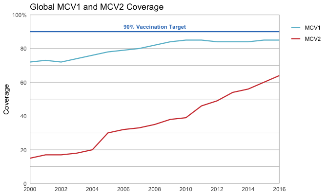

```{r setup, include=FALSE}
knitr::opts_chunk$set(echo = TRUE)
```

This visualization shows the percentage of children worldwide receiving the MCV1 and MCV2 vaccines between 2000 and 2016. Vaccination coverage has been steadily increasing for both vaccines, though neither has reached the 90% target. MCV2 coverage is lower overall than MCV1 coverage, but is increasing at a faster rate.

This is my version of the visualization. The code is included below.
```{r echo=FALSE}

```

This is the original visualization (available [here](http://www.who.int/immunization/monitoring_surveillance/who-immuniz.pdf?ua=1)).
```{r echo=FALSE}
knitr::include_graphics("originals/globalmcv.png")
```

All the code for the visualization is below

```{r, fig.asp = 0.6, out.width="100%", warning=FALSE}
# Libraries
library(tidyverse)

# Load data
file_global_regional_coverage <- "~/Datasets/who-immunization-2016/data/global_regional_coverage.csv"
global_regional_coverage <- read_csv(file_global_regional_coverage)

# Helper functions
percent_labeller <- function(vals) if_else(vals == 100, str_c(vals, "%"), str_c(vals))

# Plot
global_regional_coverage %>% 
  rename_all(str_to_lower) %>% 
  filter(
    group == "Global",
    vaccine %in% c("mcv1", "mcv2"),
    year >= 2000
  ) %>% 
  ggplot() +
  geom_line(aes(year, coverage, color = vaccine), size = 0.8) +
  geom_hline(yintercept = 90, color = "#367cc1", size = 0.8) +
  annotate(
    geom = "text",
    x = 2008, 
    y = 93, 
    hjust = 0.5, 
    label = "90% Vaccination Target", 
    color = "#367cc1",
    size = 3,
    fontface = "bold"
  ) +
  scale_x_continuous(
    breaks = seq(2000, 2016, by = 2)
  ) +
  scale_y_continuous(
    breaks = seq(0, 100, by = 20),
    limits = c(0, 100),
    labels = percent_labeller
  ) +
  scale_color_manual(
    values = c("mcv1" = "#69bcd1", "mcv2" = "#d13f3e"),
    labels = str_to_upper
  ) +
  theme_minimal() +
  theme(
    legend.justification = c("right", "top"),
    panel.grid.major.x = element_blank(),
    panel.grid.minor.x = element_blank(),
    panel.background = element_rect(color = "grey60"),
    panel.grid.minor.y = element_line(color = "grey60", size = 0.2),
    panel.grid.major.y = element_line(color = "grey60", size = 0.2)
  ) +
  coord_cartesian(
    xlim = c(2000, 2016), 
    ylim = c(0, 100), 
    expand = FALSE,
  ) +
  labs(
    x = NULL,
    y = "Coverage",
    color = NULL,
    title = "Global MCV1 and MCV2 Coverage"
  )
```