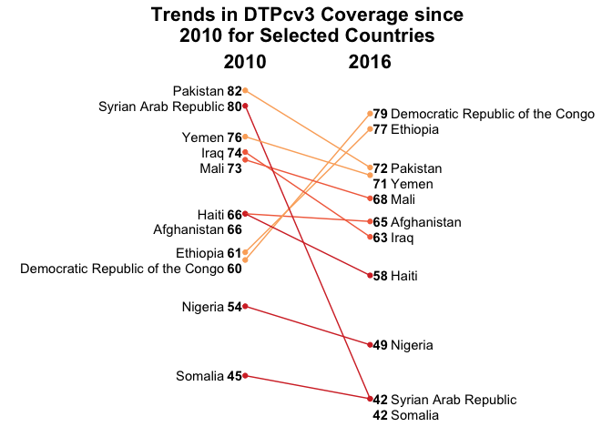

```{r setup, include=FALSE}
knitr::opts_chunk$set(echo = TRUE)
```

This visualization shows the change between 2010 and 2016 in DTP3 coverage in select countries. Like in the other DTP3 (Subnational) visualization, color is encoding coverage in 2016, which is a redundant encoding. I did find that the graph is much more pleasing to the eye with the encoding, but is much simpler to understand without it, in my opinion. For comparison I include both below!

This is my version of the visualization. The code is included below.

```{r echo=FALSE}

```

This is the original visualization (available [here](http://www.who.int/immunization/monitoring_surveillance/who-immuniz.pdf?ua=1)).

```{r echo=FALSE}
knitr::include_graphics("originals/national.png")
```

All the code for the visualization is below

```{r out.width="100%", warning=FALSE}
# Libraries --------------------------------------------------------------------
library(tidyverse)

# Constants --------------------------------------------------------------------
countries_of_interest <- c(
  "Pakistan",
  "Syrian Arab Republic",
  "Yemen",
  "Iraq",
  "Mali",
  "Afghanistan",
  "Haiti",
  "Ethiopia",
  "Democratic Republic of the Congo",
  "Nigeria",
  "Somalia"
)

# Load data --------------------------------------------------------------------
file_weunic <- "~/Datasets/who-immunization-2016/data/wuenic_master_07_06_2017.csv"
weunic <- read_csv(file_weunic)

# Prepare data to plot ---------------------------------------------------------
data <- 
  weunic %>% 
  rename_all(str_to_lower) %>% 
  filter(
    year %in% c(2010, 2016), 
    vaccine == "dtp3", 
    country %in% countries_of_interest
  ) %>% 
  select(wuenic, year, country) %>% 
  arrange(year, wuenic) %>% 
  mutate(
    diff_to_next = lead(wuenic) - wuenic,
    ynudge = case_when(
      diff_to_next == 1 ~ -1,
      diff_to_next == 0 ~ -2,
      TRUE ~ 0
    ),
    ypos = wuenic + ynudge
  )

with_colors <- 
  data %>% 
  filter(year == 2016) %>% 
  mutate(
    color = case_when(
      wuenic < 60 ~ "red",
      wuenic < 70 ~ "orange",
      TRUE ~ "yellow"
    )
  ) %>% 
  select(country, color)

data <- 
  data %>% 
  left_join(with_colors, by = "country")

# Plot  ------------------------------------------------------------------------
data %>% 
  ggplot() +
  geom_point(aes(year, wuenic, color = color)) +
  geom_segment(
    aes(
      y = `2010`,
      yend = `2016`,
      color = color
    ), 
    x = 2010, 
    xend = 2016, 
    data = data %>% 
      select(country, year, wuenic) %>% 
      spread(year, wuenic) %>% 
      left_join(with_colors, by = "country")
  ) +
  geom_text(
    aes(
      y = ypos,
      label = wuenic
    ),
    x = 2009.5,
    fontface = "bold",
    data = filter(data, year == 2010)
  ) +
  geom_text(
    aes(
      y = ypos,
      label = country
    ),
    x = 2009,
    hjust = 1,
    data = filter(data, year == 2010)
  ) +
  geom_text(
    aes(
      y = ypos,
      label = wuenic
    ),
    x = 2016.5,
    data = filter(data, year == 2016),
    fontface = "bold"
  ) +
  geom_text(
    aes(
      y = ypos,
      label = country
    ),
    x = 2017,
    hjust = 0,
    data = filter(data, year == 2016)
  ) +
  scale_x_continuous(
    breaks = c(2010, 2016), 
    limits = c(2000, 2026),
    position = "top"
  ) +
  scale_color_manual(
    values = c(
      "red" = "#d5322f",
      "orange" = "#f36d4a",
      "yellow" = "#fbad68"
    )
  ) +
  theme_minimal() +
  theme(
    panel.grid = element_blank(),
    axis.text.y = element_blank(),
    axis.text.x = element_text(
      color = "black",
      size = 16,
      face = "bold"
    ),
    plot.title = element_text(
      size = 16,
      face = "bold",
      hjust = 0.5
    ),
    legend.position = "none"
  ) +
  labs(
    x = NULL,
    y = NULL,
    title = "Trends in DTPcv3 Coverage since\n2010 for Selected Countries"
  )
```