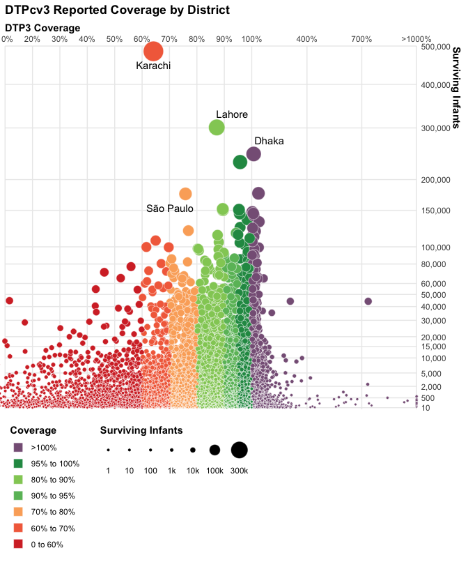
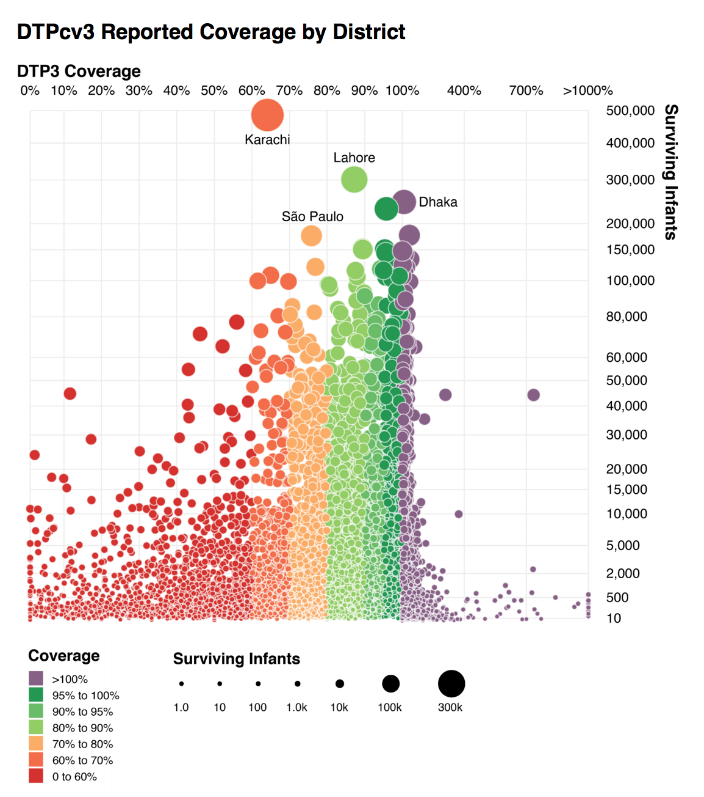

```{r setup, include=FALSE}
knitr::opts_chunk$set(echo = TRUE)
```

This visualization shows the 2016 Coverage rate and number of surviving infants at the subnational level across the world. I was struck by the aesthetics of the plot, however I am torn as to whether the redundant encoding of size and color is distracting or not. I have been taught that all redundant information should be excluded, and quite clearly each variable is encoded in two different aesthetics, however I do think the colors, at least, help to differentiate and draw the eye. Regardless, the plot was quite a challenge to replicate so I kept the redundancy just for fun.

This is my version of the visualization. The code is included below.
```{r echo=FALSE}

```

This is the original visualization (available [here](http://www.who.int/immunization/monitoring_surveillance/who-immuniz.pdf?ua=1)).
```{r echo=FALSE}

```

All the code for the visualization is below

```{r fig.asp=1.2, out.width="100%", warning=FALSE}
# Libraries
library(tidyverse)

# Load data
file_subnat <- "~/Datasets/who-immunization-2016/data/subnational_06_29_2017.csv"
data_subnat <- read_csv(file_subnat)

# Helper functions
x_trans_trans <- function(x) {
  scales::trans_new(
    "x_trans", 
    function(x) if_else(x <= 100, x, 93.5 + (x/15)), 
    function(x) if_else(x <= 100, x, (x - 93.5) * 15)
  )
}

# Constants
## Coverage constants
coverage_colors <- c(
  "0 to 60%" = "#d5322f",
  "60% to 70%" = "#f36d4a",
  "70% to 80%" = "#fbad68",
  "80% to 90%" = "#92cc64",
  "90% to 95%" = "#6abc68",
  "95% to 100%" = "#249752",
  ">100%" = "#876086"
)

coverage_order <- c(
  "0 to 60%",
  "60% to 70%",
  "70% to 80%",
  "90% to 95%",
  "80% to 90%",
  "95% to 100%",
  ">100%"
)

x_breaks <- c(seq(0, 100, by = 10), 400, 700, 1000)
x_labs <- c(str_c(head(x_breaks, -1), "%"), ">1000%")

## Surviving infants constants
y_breaks <- c(
  10, 500, 2000, 5000, 10000, 15000, 
  seq(20000, 60000, by = 10000), 
  80000, 100000, 150000, 
  seq(200000, 500000, by = 100000)
)

size_breaks <- c(1, 10, 100, 1000, 10000, 100000, 300000)
size_labels <- 
  function(vals) if_else(vals > 100, str_c(vals / 1000, "k"), str_c(vals, ""))

## Annotations
labelled <- c("Dhaka", "Lahore", "Karachi", "São Paulo")

data_subnat %>% 
  filter(
    annum == 2016, 
    Vaccode == "DTP3",
    !is.na(Admin2)
  ) %>% 
  mutate(
    color = case_when(
      Coverage <= 60 ~ "0 to 60%",
      Coverage <= 70 ~ "60% to 70%",
      Coverage <= 80 ~ "70% to 80%",
      Coverage <= 90 ~ "80% to 90%",
      Coverage <= 95 ~ "90% to 95%",
      Coverage <= 100 ~ "95% to 100%",
      TRUE ~ ">100%"
    ),
    color = factor(color, levels = coverage_order, ordered = TRUE),
    Coverage = if_else(Coverage < 1000, Coverage, 1000),
    label = if_else(Admin2 %in% labelled, Admin2, "")
  ) %>% 
  sample_frac() %>% 
  ggplot() +
  geom_point(
    aes(
      Coverage, 
      Denominator, 
      size = Denominator, 
      fill = color
    ), 
    shape = 21, 
    color = "white", 
    stroke = 0.25
  ) +
  ggrepel::geom_text_repel(
    aes(
      Coverage, 
      Denominator, 
      label = label
    ), 
    point.padding = 0.5, 
    min.segment.length = 1
  ) +
  scale_x_continuous(
    trans = "x_trans",
    breaks = x_breaks,
    labels = x_labs,
    position = "top"
  ) +
  scale_y_continuous(
    trans = "sqrt",
    breaks = y_breaks,
    labels = scales::unit_format(unit = "", scale = 1, sep = ""),
    position = "right",
    limits = c(10, 500000)
  ) +
  scale_size(
    range = c(1, 10),
    breaks = size_breaks,
    labels = size_labels,
    guide = guide_legend(
      title.position = "top", 
      nrow = 1, 
      override.aes = list(fill = "black", color = "black"),
      label.position = "bottom",
      label.hjust = 0.5
    )
  ) +
  scale_fill_manual(
    values = coverage_colors, 
    guide = guide_legend(
      title.position = "top", 
      ncol = 1,
      override.aes = list(shape = 22, size = 5),
      reverse = TRUE
    )
  ) +
  labs(
    x = "DTP3 Coverage",
    y = "Surviving Infants",
    title = "DTPcv3 Reported Coverage by District",
    fill = "Coverage",
    size = "Surviving Infants"
  ) +
  theme_minimal() +
  theme(
    axis.title.x = element_text(face = "bold", hjust = 0),
    axis.title.y = element_text(face = "bold", hjust = 0),
    legend.position = "bottom",
    legend.title = element_text(face = "bold"),
    legend.justification = "left",
    plot.title = element_text(face = "bold"),
    panel.grid.minor = element_blank()
  ) +
  coord_cartesian(
    xlim = c(10, 1000), 
    ylim = c(0, 500000), 
    expand = FALSE, 
    clip = "off"
  )
```