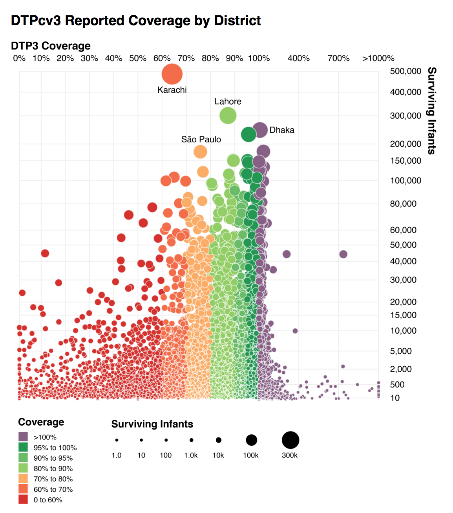
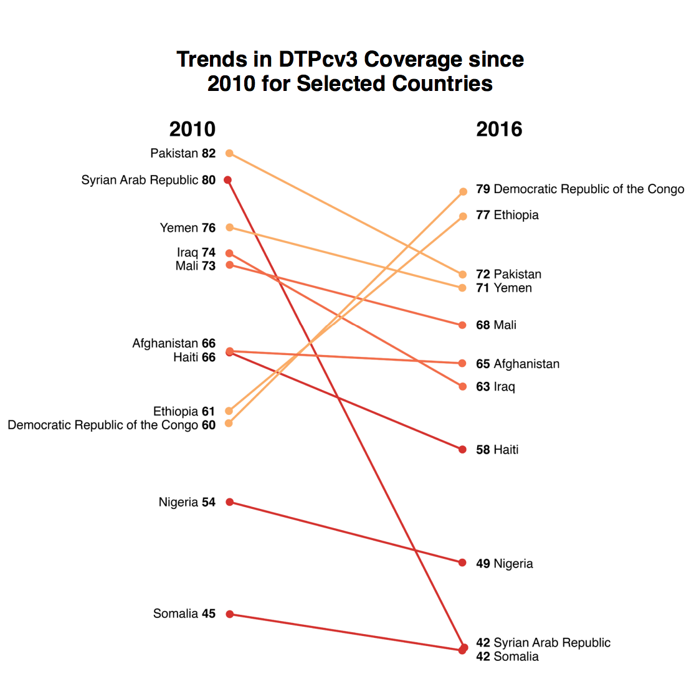

```{r setup, include=FALSE}
knitr::opts_chunk$set(echo = TRUE)
```

```{r}
library(tidyverse)
```


```{r}
DATA_DIR <- "~/GitHub/who-immunization-2016/data/"
file_global_regional_coverage <- str_c(DATA_DIR, "global_regional_coverage.csv")
file_weunic <- str_c(DATA_DIR, "wuenic_master_07_06_2017.csv")
file_subnational <- str_c(DATA_DIR, "subnational_06_29_2017.csv")
```

```{r}
global_regional_coverage <- read_csv(file_global_regional_coverage)
weunic <- read_csv(file_weunic)
subnational <- read_csv(file_subnational)
```

## Global Coverage

```{r, fig.asp = 0.6, out.width="100%"}
percent_labeller <- function(vals) if_else(vals == 100, str_c(vals, "%"), str_c(vals))

global_regional_coverage %>% 
  rename_all(str_to_lower) %>% 
  filter(
    group == "Global",
    vaccine %in% c("mcv1", "mcv2"),
    year >= 2000
  ) %>% 
  ggplot() +
  geom_line(aes(year, coverage, color = vaccine), size = 0.8) +
  geom_hline(yintercept = 90, color = "#367cc1", size = 0.8) +
  annotate(
    geom = "text",
    x = 2008, 
    y = 93, 
    hjust = 0.5, 
    label = "90% Vaccination Target", 
    color = "#367cc1",
    size = 3,
    fontface = "bold"
  ) +
  scale_x_continuous(
    breaks = seq(2000, 2016, by = 2)
  ) +
  scale_y_continuous(
    breaks = seq(0, 100, by = 20),
    limits = c(0, 100),
    labels = percent_labeller
  ) +
  scale_color_manual(
    values = c("mcv1" = "#69bcd1", "mcv2" = "#d13f3e"),
    labels = str_to_upper
  ) +
  theme_minimal() +
  theme(
    legend.justification = c("right", "top"),
    panel.grid.major.x = element_blank(),
    panel.grid.minor.x = element_blank(),
    panel.background = element_rect(color = "grey60"),
    panel.grid.minor.y = element_line(color = "grey60", size = 0.2),
    panel.grid.major.y = element_line(color = "grey60", size = 0.2)
  ) +
  labs(
    x = NULL,
    y = "Coverage",
    color = NULL,
    title = "Global MCV1 and MCV2 Coverage"
  )
```

```{r}
knitr::include_graphics("globalmcv.png")
```

## Subnational Coverage

```{r fig.asp=1.2, out.width="100%"}
x_trans_trans <- function(x) {
  scales::trans_new(
    "x_trans", 
    function(x) if_else(x <= 100, x, 93.5 + (x/15)), 
    function(x) if_else(x <= 100, x, (x - 93.5) * 15)
  )
}

coverage_colors <- c(
  "0 to 60%" = "#d5322f",
  "60% to 70%" = "#f36d4a",
  "70% to 80%" = "#fbad68",
  "80% to 90%" = "#92cc64",
  "90% to 95%" = "#6abc68",
  "95% to 100%" = "#249752",
  ">100%" = "#876086"
)

coverage_order <- c(
  "0 to 60%",
  "60% to 70%",
  "70% to 80%",
  "90% to 95%",
  "80% to 90%",
  "95% to 100%",
  ">100%"
)

labelled <- c("Dhaka", "Lahore", "Karachi", "São Paulo")

x_breaks <- c(seq(0, 100, by = 10), 400, 700, 1000)
x_labs <- c(str_c(head(x_breaks, -1), "%"), ">1000%")

y_breaks <- c(
  10, 500, 2000, 5000, 10000, 15000, 
  seq(20000, 60000, by = 10000), 
  80000, 100000, 150000, 
  seq(200000, 500000, by = 100000)
)

size_breaks <- c(1, 10, 100, 1000, 10000, 100000, 300000)
size_labels <- 
  function(vals) if_else(vals > 100, str_c(vals / 1000, "k"), str_c(vals, ""))

subnational %>% 
  filter(
    annum == 2016, 
    Vaccode == "DTP3",
    !is.na(Admin2)
  ) %>% 
  mutate(
    color = case_when(
      Coverage <= 60 ~ "0 to 60%",
      Coverage <= 70 ~ "60% to 70%",
      Coverage <= 80 ~ "70% to 80%",
      Coverage <= 90 ~ "80% to 90%",
      Coverage <= 95 ~ "90% to 95%",
      Coverage <= 100 ~ "95% to 100%",
      TRUE ~ ">100%"
    ),
    color = factor(color, levels = coverage_order, ordered = TRUE),
    Coverage = if_else(Coverage < 1000, Coverage, 1000),
    label = if_else(Admin2 %in% labelled, Admin2, "")
  ) %>% 
  sample_frac() %>% 
  ggplot() +
  geom_point(
    aes(
      Coverage, 
      Denominator, 
      size = Denominator, 
      fill = color
    ), 
    shape = 21, 
    color = "white", 
    stroke = 0.25
  ) +
  ggrepel::geom_text_repel(
    aes(
      Coverage, 
      Denominator, 
      label = label
    ), 
    point.padding = 0.5, 
    min.segment.length = 1
  ) +
  scale_x_continuous(
    trans = "x_trans",
    breaks = x_breaks,
    labels = x_labs,
    position = "top"
  ) +
  scale_y_continuous(
    trans = "sqrt",
    breaks = y_breaks,
    labels = scales::unit_format(unit = "", scale = 1, sep = ""),
    position = "right",
    limits = c(10, 500000)
  ) +
  scale_size(
    range = c(1, 10),
    breaks = size_breaks,
    labels = size_labels,
    guide = guide_legend(
      title.position = "top", 
      nrow = 1, 
      override.aes = list(fill = "black", color = "black"),
      label.position = "bottom",
      label.hjust = 0.5
    )
  ) +
  scale_fill_manual(
    values = coverage_colors, 
    guide = guide_legend(
      title.position = "top", 
      ncol = 1,
      override.aes = list(shape = 22, size = 5),
      reverse = TRUE
    )
  ) +
  labs(
    x = "DTP3 Coverage",
    y = "Surviving Infants",
    title = "DTPcv3 Reported Coverage by District",
    fill = "Coverage",
    size = "Surviving Infants"
  ) +
  theme_minimal() +
  theme(
    axis.title.x = element_text(face = "bold", hjust = 0),
    axis.title.y = element_text(face = "bold", hjust = 0),
    legend.position = "bottom",
    legend.title = element_text(face = "bold"),
    legend.justification = "left",
    plot.title = element_text(face = "bold"),
    panel.grid.minor = element_blank()
  ) +
  coord_cartesian(xlim = c(10, 1000), ylim = c(0, 500000), expand = FALSE, clip = "off")
```

```{r}

```


## Trends in DTP3 by country

```{r out.width="100%"}
countries_of_interest <- c(
  "Pakistan",
  "Syrian Arab Republic",
  "Yemen",
  "Iraq",
  "Mali",
  "Afghanistan",
  "Haiti",
  "Ethiopia",
  "Democratic Republic of the Congo",
  "Nigeria",
  "Somalia"
)

data <- 
  weunic %>% 
  rename_all(str_to_lower) %>% 
  filter(
    year %in% c(2010, 2016), 
    vaccine == "dtp3", 
    country %in% countries_of_interest
  ) %>% 
  select(wuenic, year, country) %>% 
  arrange(year, wuenic) %>% 
  mutate(
    diff_to_next = lead(wuenic) - wuenic,
    ynudge = case_when(
      diff_to_next == 1 ~ -1,
      diff_to_next == 0 ~ -2,
      TRUE ~ 0
    ),
    ypos = wuenic + ynudge,
  )

with_colors <- 
  data %>% 
  filter(year == 2016) %>% 
  mutate(
    color = case_when(
      wuenic < 60 ~ "red",
      wuenic < 70 ~ "orange",
      TRUE ~ "yellow"
    )
  ) %>% 
  select(country, color)

data <- 
  data %>% 
  left_join(with_colors, by = "country")

data %>% 
  ggplot() +
  geom_point(aes(year, wuenic, color = color)) +
  geom_segment(
    aes(
      y = `2010`,
      yend = `2016`,
      color = color
    ), 
    x = 2010, 
    xend = 2016, 
    data = data %>% 
      select(country, year, wuenic) %>% 
      spread(year, wuenic) %>% 
      left_join(with_colors, by = "country")
  ) +
  geom_text(
    aes(
      y = ypos,
      label = wuenic
    ),
    x = 2009.5,
    fontface = "bold",
    data = filter(data, year == 2010)
  ) +
  geom_text(
    aes(
      y = ypos,
      label = country
    ),
    x = 2009,
    hjust = 1,
    data = filter(data, year == 2010)
  ) +
  geom_text(
    aes(
      y = ypos,
      label = wuenic
    ),
    x = 2016.5,
    data = filter(data, year == 2016),
    fontface = "bold"
  ) +
  geom_text(
    aes(
      y = ypos,
      label = country
    ),
    x = 2017,
    hjust = 0,
    data = filter(data, year == 2016)
  ) +
  scale_x_continuous(
    breaks = c(2010, 2016), 
    limits = c(2000, 2026),
    position = "top"
  ) +
  scale_color_manual(
    values = c(
      "red" = "#d5322f",
      "orange" = "#f36d4a",
      "yellow" = "#fbad68"
    )
  ) +
  theme_minimal() +
  theme(
    panel.grid = element_blank(),
    axis.text.y = element_blank(),
    axis.text.x = element_text(
      color = "black",
      size = 16,
      face = "bold"
    ),
    plot.title = element_text(
      size = 16,
      face = "bold",
      hjust = 0.5
    ),
    legend.position = "none"
  ) +
  labs(
    x = NULL,
    y = NULL,
    title = "Trends in DTPcv3 Coverage since\n2010 for Selected Countries"
  )
```


```{r}

```

