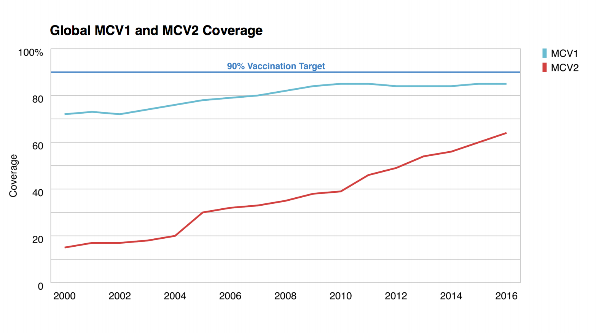
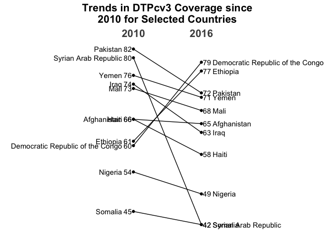

Who Immunization 2016
================

``` r
library(tidyverse)
```

    ## ── Attaching packages ────────────────────────────────────────────────────────────────────────────────────────────── tidyverse 1.2.1 ──

    ## ✔ ggplot2 2.2.1.9000     ✔ purrr   0.2.5     
    ## ✔ tibble  1.4.2          ✔ dplyr   0.7.4     
    ## ✔ tidyr   0.8.0          ✔ stringr 1.3.0     
    ## ✔ readr   1.1.1          ✔ forcats 0.3.0

    ## ── Conflicts ───────────────────────────────────────────────────────────────────────────────────────────────── tidyverse_conflicts() ──
    ## ✖ dplyr::filter() masks stats::filter()
    ## ✖ dplyr::lag()    masks stats::lag()
    ## ✖ dplyr::vars()   masks ggplot2::vars()

``` r
DATA_DIR <- "~/GitHub/who-immunization-2016/data/"
file_global_regional_coverage <- str_c(DATA_DIR, "global_regional_coverage.csv")
file_stamen <- str_c(DATA_DIR, "Stamen20171121-revised.csv")
file_weunic <- str_c(DATA_DIR, "wuenic_master_07_06_2017.csv")
file_subnational <- str_c(DATA_DIR, "subnational_06_29_2017.csv")
```

``` r
global_regional_coverage <- read_csv(file_global_regional_coverage)
```

    ## Parsed with column specification:
    ## cols(
    ##   Group = col_character(),
    ##   Affiliation = col_character(),
    ##   Year = col_integer(),
    ##   Vaccine = col_character(),
    ##   Target = col_integer(),
    ##   Vaccinated = col_integer(),
    ##   Coverage = col_integer(),
    ##   Unvaccinated = col_integer()
    ## )

``` r
stamen <- read_csv(file_stamen)
```

    ## Parsed with column specification:
    ## cols(
    ##   iso = col_character(),
    ##   RefCty_NameWorkingEnglish = col_character(),
    ##   RefCty_RefReg_WHOregionCode = col_character(),
    ##   annum = col_integer(),
    ##   Vaccode = col_character(),
    ##   Admin1 = col_character(),
    ##   Admin2 = col_character(),
    ##   DenomType = col_character(),
    ##   Denominator = col_integer(),
    ##   CalcNum = col_integer(),
    ##   Coverage = col_double()
    ## )

``` r
weunic <- read_csv(file_weunic)
```

    ## Parsed with column specification:
    ## cols(
    ##   .default = col_integer(),
    ##   Country = col_character(),
    ##   ProductionDate = col_character(),
    ##   ISOCountryCode = col_character(),
    ##   Vaccine = col_character(),
    ##   ReportedTimeSeriesSource = col_character(),
    ##   Rule = col_character(),
    ##   Comment = col_character(),
    ##   X = col_character()
    ## )

    ## See spec(...) for full column specifications.

``` r
subnational <- read_csv(file_subnational)
```

    ## Parsed with column specification:
    ## cols(
    ##   iso = col_character(),
    ##   RefCty_NameWorkingEnglish = col_character(),
    ##   RefCty_RefReg_WHOregionCode = col_character(),
    ##   annum = col_integer(),
    ##   Vaccode = col_character(),
    ##   Admin1 = col_character(),
    ##   Admin2 = col_character(),
    ##   DenomType = col_character(),
    ##   Denominator = col_integer(),
    ##   CalcNum = col_integer(),
    ##   Coverage = col_double()
    ## )

``` r
summary(global_regional_coverage)
```

    ##     Group           Affiliation             Year        Vaccine         
    ##  Length:3685        Length:3685        Min.   :1980   Length:3685       
    ##  Class :character   Class :character   1st Qu.:1992   Class :character  
    ##  Mode  :character   Mode  :character   Median :2002   Mode  :character  
    ##                                        Mean   :2000                     
    ##                                        3rd Qu.:2010                     
    ##                                        Max.   :2016                     
    ##                                                                         
    ##      Target            Vaccinated           Coverage    
    ##  Min.   :        0   Min.   :        0   Min.   : 0.00  
    ##  1st Qu.: 12860924   1st Qu.:  3135797   1st Qu.:22.00  
    ##  Median : 22875483   Median : 10566617   Median :71.00  
    ##  Mean   : 35045293   Mean   : 17939776   Mean   :57.05  
    ##  3rd Qu.: 41437388   3rd Qu.: 22938961   3rd Qu.:88.00  
    ##  Max.   :140541608   Max.   :123162933   Max.   :99.00  
    ##                                          NA's   :1      
    ##   Unvaccinated      
    ##  Min.   :        0  
    ##  1st Qu.:  2073568  
    ##  Median :  7827216  
    ##  Mean   : 17105517  
    ##  3rd Qu.: 23177423  
    ##  Max.   :130650714  
    ## 

``` r
global_regional_coverage %>% 
  rename_all(str_to_lower) %>% 
  filter(group == "Global") %>% 
  ggplot() +
  geom_line(aes(year, vaccinated, color = vaccine))
```


The raw data shows the number of vaccinations going up across all vaccines. I wonder what this looks like as a proportion of the target number.

``` r
global_regional_coverage %>% 
  rename_all(str_to_lower) %>% 
  mutate(prop_vaccinated = vaccinated / target) %>% 
  filter(group == "Global") %>% 
  ggplot() +
  geom_line(aes(year, prop_vaccinated, color = vaccine))
```


Almost identical!

``` r
percent_labeller <- function(vals) if_else(vals == 100, str_c(vals, "%"), str_c(vals))

global_regional_coverage %>% 
  rename_all(str_to_lower) %>% 
  filter(
    group == "Global",
    vaccine %in% c("mcv1", "mcv2"),
    year >= 2000
  ) %>% 
  ggplot() +
  geom_line(aes(year, coverage, color = vaccine), size = 0.8) +
  geom_hline(yintercept = 90, color = "#367cc1", size = 0.8) +
  geom_text(
    x = 2008, 
    y = 93, 
    hjust = 0.5, 
    label = "90% Vaccination Target", 
    color = "#367cc1"
  ) +
  scale_x_continuous(
    breaks = seq(2000, 2016, by = 2)
  ) +
  scale_y_continuous(
    breaks = seq(0, 100, by = 20),
    limits = c(0, 100),
    labels = percent_labeller
  ) +
  scale_color_manual(
    values = c("mcv1" = "#69bcd1", "mcv2" = "#d13f3e"),
    labels = str_to_upper
  ) +
  theme_minimal() +
  theme(
    legend.justification = c("right", "top"),
    panel.grid.major.x = element_blank(),
    panel.grid.minor.x = element_blank(),
    panel.background = element_rect(color = "grey60"),
    panel.grid.minor.y = element_line(color = "grey60", size = 0.2),
    panel.grid.major.y = element_line(color = "grey60", size = 0.2)
  ) +
  labs(
    x = NULL,
    y = "Coverage",
    color = NULL,
    title = "Global MCV1 and MCV2 Coverage"
  )
```


``` r

```


Subnational
-----------

``` r
x_trans_trans <- function(x) {
  scales::trans_new(
    "x_trans", 
    function(x) case_when(x <= 100 ~ x, x <= 1000 ~ 93.5 + (x/15), TRUE ~ 160), 
    function(x) if_else(x <= 100, x, 3*x))
}

subnational %>% 
  filter(
    annum == 2016, 
    Vaccode == "DTP3"
  ) %>% 
  mutate(
    color = case_when(
      Coverage <= 60 ~ "0 to 60%",
      Coverage <= 70 ~ "60% to 70%",
      Coverage <= 80 ~ "70% to 80%",
      Coverage <= 90 ~ "80% to 90%",
      Coverage <= 95 ~ "90% to 95%",
      Coverage <= 100 ~ "90% to 100%",
      TRUE ~ ">100%"
    )
  ) %>% 
  filter(
    Coverage <= 1000 || Denominator <= 2000
  ) %>% 
  ggplot(aes(Coverage, Denominator, size = Denominator, fill = color)) +
  geom_point(shape = 21, color = "white") +
  scale_x_continuous(
    trans = "x_trans",
    breaks = c(seq(0, 100, by = 10), 500, 700, 1000)
  ) +
  scale_y_continuous(
    trans = "sqrt",
    breaks = c(10, 500, 2000, 5000, 10000, 15000, seq(20000, 60000, by = 10000), 80000, 100000, 150000, seq(200000, 500000, by = 100000))
  ) +
  scale_size(
    range = c(1, 10),
    breaks = c(1, 10, 100, 1000, 10000, 100000, 300000)
  )
```

    ## Warning: Transformation introduced infinite values in continuous x-axis

    ## Warning: Removed 288 rows containing missing values (geom_point).


Trends in DTP3 by country
-------------------------

``` r
glimpse(weunic)
```

    ## Observations: 31,463
    ## Variables: 21
    ## $ Country                  <chr> "Afghanistan", "Afghanistan", "Afghan...
    ## $ ProductionDate           <chr> "Tue Jul 04 14:13:44 2017", "Tue Jul ...
    ## $ ISOCountryCode           <chr> "afg", "afg", "afg", "afg", "afg", "a...
    ## $ Vaccine                  <chr> "bcg", "bcg", "bcg", "bcg", "bcg", "b...
    ## $ Year                     <int> 1997, 1998, 1999, 2000, 2001, 2002, 2...
    ## $ WUENIC                   <int> 43, 35, 38, 30, 43, 46, 44, 51, 57, 6...
    ## $ WUENICPreviousRevision   <int> 43, 35, 38, 30, 43, 46, 44, 51, 57, 6...
    ## $ GradeOfConfidence        <int> 2, 2, 2, 1, 2, 2, 1, 1, 1, 1, 1, 1, 1...
    ## $ AdministrativeCoverage   <int> 43, NA, 43, 38, 66, 59, 56, 65, 73, 7...
    ## $ GovernmentEstimate       <int> NA, 35, 38, 30, 43, 46, 44, 51, 57, 6...
    ## $ ReportedCoverage         <int> 43, 35, 38, 30, 43, 46, 44, 51, 57, 6...
    ## $ ChildrenVaccinated       <int> NA, NA, 381008, 412754, 494628, 55812...
    ## $ ChildrenInTarget         <int> NA, NA, 878443, 1079435, 747690, 9432...
    ## $ BirthsUNPD               <int> 873434, 909524, 942789, 972843, 99983...
    ## $ SurvivingInfantsUNPD     <int> 786596, 820860, 852610, 881540, 90781...
    ## $ ReportedTimeSeries       <int> 43, 35, 38, 30, 43, 46, 44, 51, 57, 6...
    ## $ ReportedTimeSeriesSource <chr> "admin", "gov", "gov", "gov", "gov", ...
    ## $ SurveyInformation        <int> NA, NA, NA, NA, NA, NA, NA, NA, NA, N...
    ## $ Rule                     <chr> "R: AP", "R:", "R:", "R:", "R:", "R:"...
    ## $ Comment                  <chr> "Legacy estimate.  Trend in official ...
    ## $ X                        <chr> NA, NA, NA, NA, NA, NA, NA, NA, NA, N...

``` r
countries_of_interest <- c(
  "Pakistan",
  "Syrian Arab Republic",
  "Yemen",
  "Iraq",
  "Mali",
  "Afghanistan",
  "Haiti",
  "Ethiopia",
  "Democratic Republic of the Congo",
  "Nigeria",
  "Somalia"
)

data <- 
  weunic %>% 
  rename_all(str_to_lower) %>% 
  filter(
    year %in% c(2010, 2016), 
    vaccine == "dtp3", 
    country %in% countries_of_interest
  ) %>% 
  select(wuenic, year, country)

data 
```

    ## # A tibble: 22 x 3
    ##    wuenic  year country                         
    ##     <int> <int> <chr>                           
    ##  1     66  2010 Afghanistan                     
    ##  2     65  2016 Afghanistan                     
    ##  3     60  2010 Democratic Republic of the Congo
    ##  4     79  2016 Democratic Republic of the Congo
    ##  5     61  2010 Ethiopia                        
    ##  6     77  2016 Ethiopia                        
    ##  7     66  2010 Haiti                           
    ##  8     58  2016 Haiti                           
    ##  9     74  2010 Iraq                            
    ## 10     63  2016 Iraq                            
    ## # ... with 12 more rows

``` r
data %>% 
  ggplot() +
  geom_point(aes(year, wuenic)) +
  geom_segment(
    aes(
      y = `2010`,
      yend = `2016`
    ), 
    x = 2010, 
    xend = 2016, 
    data = spread(data, year, wuenic)
  ) +
  geom_text(
    aes(
      y = wuenic,
      label = wuenic
    ),
    x = 2009.5,
    data = filter(data, year == 2010)
  ) +
  geom_text(
    aes(
      y = wuenic,
      label = country
    ),
    x = 2009,
    hjust = 1,
    data = filter(data, year == 2010)
  ) +
  geom_text(
    aes(
      y = wuenic,
      label = wuenic
    ),
    x = 2016.5,
    data = filter(data, year == 2016)
  ) +
  geom_text(
    aes(
      y = wuenic,
      label = country
    ),
    x = 2017,
    hjust = 0,
    data = filter(data, year == 2016)
  ) +
  scale_x_continuous(breaks = c(2010, 2016), limits = c(2000, 2026)) +
  theme_minimal() +
  theme(
    panel.grid = element_blank(),
    axis.text.y = element_blank(),
    plot.title = element_text(hjust = 0.5)
  ) +
  labs(
    x = NULL,
    y = NULL,
    title = "Trends in DTPcv3 Coverage since\n2010 for Selected Countries"
  )
```



-   Nudge y aesthetic
-   Color?
-   X axis to the top
